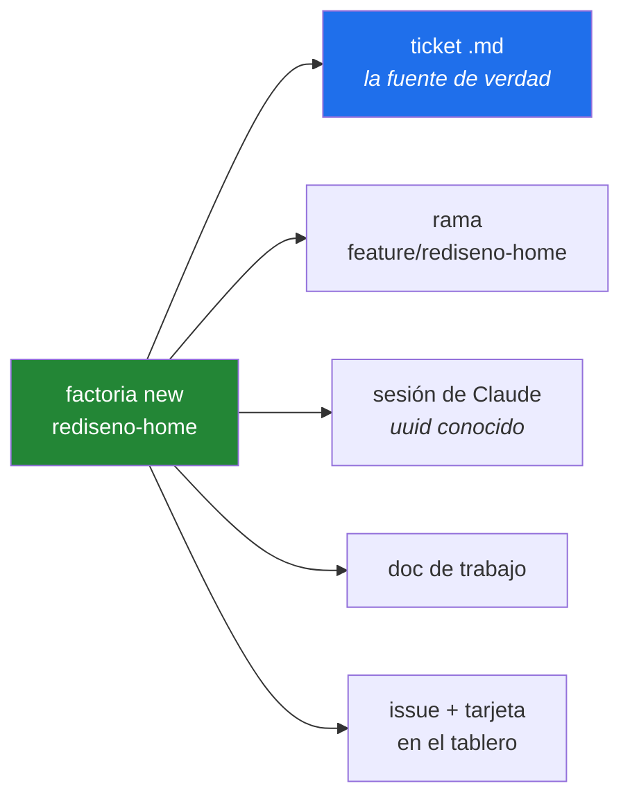
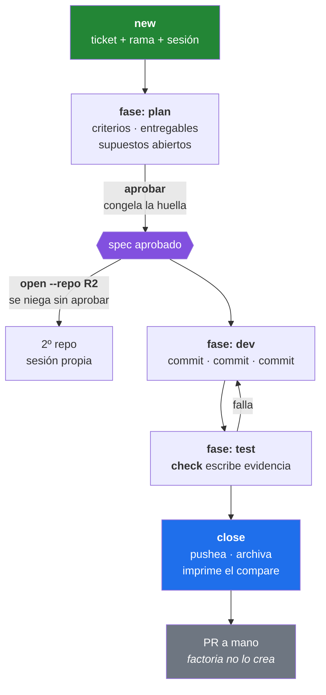
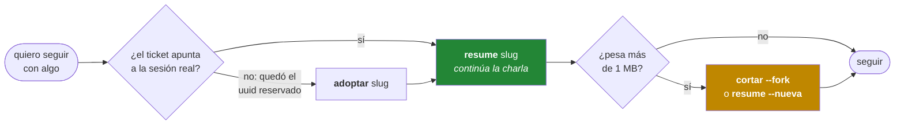
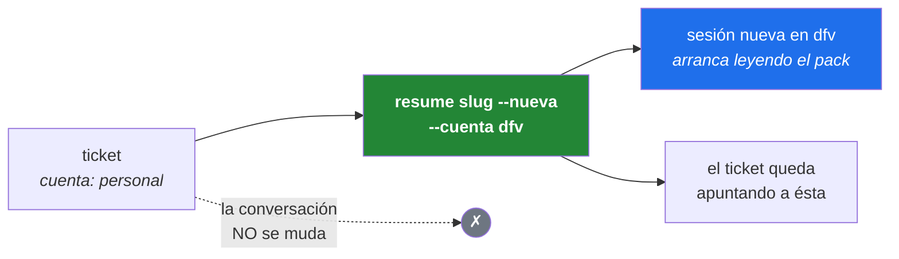
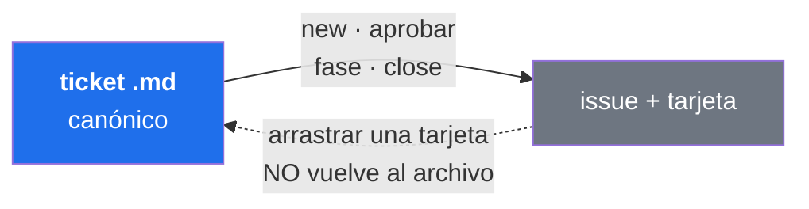
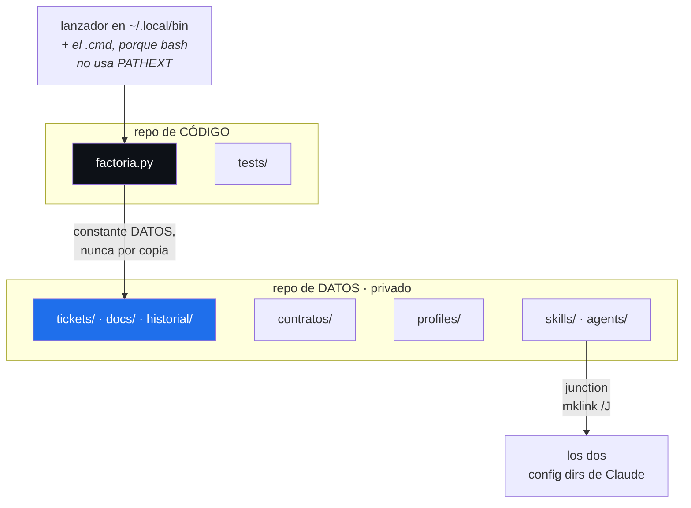

# factoria

Gestor de tickets, sesiones y documentación para el ecosistema DFV. Un archivo
Python, 23 comandos, sin servidor y sin base de datos.



Un comando y ya tenés las cinco cosas atadas entre sí. Después todo se hace por
el slug: `factoria resume rediseno-home` te devuelve **la misma conversación**,
en la cuenta y el directorio correctos.

## Los primeros 5 minutos

```bash
factoria board                    # ¿qué hay? Solo lectura, no puede romper nada
factoria tickets                  # los tickets en vuelo
factoria new probar --repo defeve --pedido "lo que te pidieron, literal"
#   ...escribís criterios y supuestos en la sesión que se abrió...
factoria commit --mensaje "feat: primer cambio"
factoria check --slug probar      # corre los gates y escribe la evidencia
factoria close probar             # pushea, archiva, imprime el compare
```

## El ciclo completo



Los comandos, en el orden en que se usan:

| Paso | Comando | Qué pasa |
|---|---|---|
| 1 | `new <slug> --repo R` | ticket en `fase: plan`, **rama nueva** `<tipo>/<slug>`, sesión con uuid conocido, issue + tarjeta |
| 2 | *(en la sesión)* | se escriben `## Criterios de aceptación`, `## Entregables de código` y `## Supuestos abiertos` |
| 3 | `aprobar <slug>` | congela la huella de criterios + fuera de alcance |
| 4 | `open <slug> --repo R2` | suma un 2º repo con su propia sesión. **Se niega si no está aprobado** |
| 5 | `commit --mensaje "…"` | valida `<tipo>: <imperativo>` ≤60 chars, protege ramas y archivos |
| 6 | `check --slug <slug>` | corre los `verify:` del perfil + las cotas, y escribe la evidencia |
| 7 | `fase <slug> dev\|test` | metadata. **No corta la sesión** |
| 8 | `close <slug>` | archiva el cuerpo e imprime **los pasos que faltan a mano**, en orden. `--sin-pushear` para cerrar sin tocar el remoto |

Flags de `new` que importan: `--aqui` (no crear rama, usar la actual),
`--pedido "…"` (en vez de abrir el editor), `--no-lanzar`, `--tipo fix|chore`.

### Qué se declara en `plan`

Cuatro secciones, y las tres primeras `aprobar` las exige no vacías:

- **`## Pedido crudo`** — literal, como llegó. Se escribe una vez y no se toca
  más: es contra lo que se compara si después hubo malentendido.
- **`## Criterios de aceptación`** — cada uno respondible con sí/no y nombrando
  *su* evidencia. "funciona bien" no es un criterio.
- **`## Fuera de alcance`** — lo que se decidió NO hacer.
- **`## Entregables de código`** — qué se va a tocar, **por unidad con nombre en
  el sistema**: un servicio, un endpoint, una tabla, una pantalla, un job. Con
  el verbo adelante, porque crear y tocar algo preexistente no cuestan lo mismo
  de revisar:

  ```markdown
  - **nuevo** servicio `AuthService` — emite y valida el token
  - **modifica** `LoginController` — delega en AuthService, saca el check inline
  - **nuevo** endpoint `GET /api/usuarios` — solo rol `admin`
  - **nueva** tabla `usuario_sesion`
  ```

  **Si la unidad declara permisos, el rol o tipo de usuario permitido va en la
  misma línea** — `solo rol admin`, `cualquier usuario autenticado`, `público`.
  Un permiso sin rol declarado no se puede revisar: es de las pocas cosas que,
  mal interpretadas, no se ven hasta que ya están en producción.

  Si no sabés cómo nombrarlo no es un entregable, es implementación; y si pasás
  de ~7 bullets el ticket son dos tickets. Nada de firmas ni de snippets: para
  eso está el doc de trabajo.
- **`## Supuestos abiertos`** — cada cosa que el modelo tuvo que adivinar,
  escrita **como adivinanza**. Acá `aprobar` avisa pero no bloquea: un ticket
  sin supuestos es sospechoso, no inválido.

**La huella que congela `aprobar` es criterios + fuera de alcance, y nada más.**
Los entregables se exigen pero no se congelan a propósito: son el *dónde*, no el
*qué*, y descubrir superficie nueva durante `dev` es sano. Pintarlo de
spec-drift rojo convertiría el gate en ruido.

### Cerrar sin pushear

`close` pushea por defecto. Con `--sin-pushear` no toca el remoto y el push pasa
a ser el primer paso de la lista que imprime:

```
Falta a mano, en este orden:

  defeve
    1. git -C C:\ariel\dfv\wt\rediseno-home push -u origin feature/rediseno-home
    2. abrir el PR a mano en Bitbucket:  https://bitbucket.org/dfvsrl/defeve/branch/...
    3. cuando el PR este mergeado, y no antes:
         factoria close mi-slug --repo defeve --limpiar-worktree
         git -C C:\ariel\dfv\defeve branch -d feature/rediseno-home
         git -C C:\ariel\dfv\defeve push origin --delete feature/rediseno-home
```

El orden no es decorativo: el worktree va **antes** del borrado local, porque
mientras la rama esté checkouteada ahí `branch -d` no puede sacarla. Y es `-d`
minúscula a propósito — si falla, algo no se mergeó: hay que mirar, no forzar
con `-D`.

Si la rama registrada es la base (pasa con `new --aqui`) o está en
`ramas_prohibidas`, **no propone borrarla**. Y cerrar dos veces no re-archiva:
el historial no se pisa.

## Volver a una tarea



```bash
factoria resume <slug>              # sin argumentos, lista lo que hay en vuelo
factoria resume <slug> --nueva      # sesión NUEVA con el pack, registrada en el ticket
factoria adoptar <slug>             # registra la sesión que hizo el trabajo de verdad
factoria cortar <slug> --fork       # ramifica cuando pesa, preservando la anterior
factoria contexto <slug>            # el pack mínimo: ticket + doc de trabajo + vecinos
```

### Cambiar de cuenta

**Las cuentas `dfv` y `personal` son transcripts disjuntos** (dos directorios
distintos, 0 uuid en común sobre 337): una sesión **no se puede reanudar desde
la otra cuenta**. Pero el trabajo sí se muda, y es un solo comando:

```bash
factoria resume <slug> --nueva --cuenta dfv
```



Hace las tres cosas juntas: abre la sesión en la cuenta que le pidas, le pasa el
pack de `contexto` como **primer prompt**, y la deja **registrada en el ticket**
— así el `resume` siguiente ya cae ahí. La anterior queda intacta, y `adoptar`
la vuelve a encontrar cuando la necesites.

Si al final no se lanza nada — por ejemplo porque estás adentro de otra sesión —
**el registro se revierte**. Un uuid escrito que nadie va a abrir es justo el
fantasma que `adoptar` viene a arreglar.

| Quiero… | Comando |
|---|---|
| **seguir el ticket en la otra cuenta** | `resume <slug> --nueva --cuenta dfv` |
| la sesión que ya existe, en su cuenta | `resume <slug> --repo R` |
| cortar porque se puso cara | `cortar <slug>` (limpia, con pack) o `--fork` (ramifica) |
| arreglar "el ticket apunta a un uuid fantasma" | `adoptar <slug>` |
| registrar la sesión en la que ya estoy sentado | `adoptar <slug> --aqui` |
| una entrada nueva para un 2º repo | `open <slug> --repo R2 --cuenta personal` |

`adoptar` **sin uuid busca por evidencia**: la sesión cuyo transcript nombra el
slug, en las dos cuentas, y le repunta también la cuenta. Si ninguna lo nombra
se niega y lista las candidatas, en vez de tomar "la más reciente con el mismo
`cwd`" — ese `cwd` lo comparten 6 sesiones de temas distintos, así que esa
heurística elige conversaciones ajenas.

La diferencia entre los dos: **`--nueva` abre la sesión**, `--aqui` registra una
que ya está abierta y en la que estás trabajando.

## El tablero de GitHub



Una sola vía. El tablero es un **espejo legible**, y cada campo sale del front
matter del ticket:

| En el ticket | En GitHub |
|---|---|
| `slug` | título del issue |
| `fase` | campo `fase` → **la columna del tablero** |
| `spec_congelado` | campo `spec`: `sin aprobar` / `aprobado` / `deriva` |
| `repos[].cuenta` | campo `cuenta` + label `cuenta:dfv` |
| `repos[].rama` | campo `rama` |
| `repos[].repo` | labels `repo:defeve`, `repo:Cotizaciones`… |
| pedido, criterios, fuera de alcance, entregables, supuestos | cuerpo del issue, regenerado |
| `abierto: false` | issue cerrado |

Los repos van como **label** y no como campo del Project porque un ticket cruza
repos por naturaleza y un single-select no puede tener N valores.

Sin red o sin `gh`, **todo comando sigue funcionando** y `board` avisa
`espejo N tickets abiertos sin issue`. `factoria abrir <slug>` abre el issue en
el navegador; `factoria espejo --todos` resincroniza.

> ⚠️ Los `- [ ]` de los criterios se ven como checklist en el issue, pero son de
> **solo lectura**: tildarlos ahí se pierde en la próxima sincronización.

**Dos pasos que quedan en la UI** — `gh` no puede configurar vistas: agrupar el
tablero por `fase` (⋯ del board → *Group* → `fase`) y apagar los dos workflows
de fábrica que repueblan `Status` (⚙ → *Workflows*). `Status` no se puede
borrar: es un campo built-in de GitHub.

## Mirar el estado

```bash
factoria board       # el relevamiento completo + HALLAZGOS
factoria tickets     # fase, repo, rama, cuenta, sesión, issue, líneas
factoria cotas       # mide las cotas del estándar y SALE CON 1 si alguna se pasó
factoria sesiones --paralelas          # ramas con más de una sesión viva
factoria grafo --que-toca <archivo>    # quién más tocó eso
factoria grafo --bloqueos              # la cadena de dependencias cross-repo
```

## Mantenimiento

| Comando | Para qué |
|---|---|
| `espejo [<slug>] [--todos] [--probar]` | resincroniza. `--probar` diagnostica sin escribir |
| `skills [<fase>]` | qué skill de mattpocock usar en cada fase, y cuál queda afuera |
| `sync-skills [--desvincular]` | vincula las skills y agents del repo de datos a los dos config dirs |
| `perfiles` | genera un perfil por repo detectando dónde van sus docs |
| `rama <slug> <nueva> [--solo-registro]` | renombra la rama. `--solo-registro` si la rama es ajena |
| `renombrar <slug> <nuevo>` | renombra el ticket, sus docs y sus ramas |
| `check --instalar-pre-push` | pobla el `hooksPath` del repo con un pre-push que corre `check` |
| `commit --imprimir-hook` | el stanza de `Stop` para pegar en `settings.local.json` |

## Dónde vive todo



| Qué | Dónde |
|---|---|
| código | `C:\ariel\integhra\factoria` |
actoria` |
| datos (privado) | `C:\ariel\.factoria` |
| contratos | `C:\ariel\dfv\.contracts` → junction a `.factoria\contratos` |
| skills en uso | `~\.claude-dfv\skills` y `~\.claude-personal\skills` → junctions |

Los lanzadores ejecutan **el archivo que esté checkouteado**. Ningún archivo vive
en los dos repos: las skills salen del repo de datos, que es privado justamente
porque nombran repos y rutas internas.

## Las cuatro reglas que explican el resto

1. **La fase no corta la sesión.** Reconstruir contexto cuesta más que seguir. Se
   corta cuando el `.jsonl` pesa (`board` lo dice), no cuando cambia la fase.
2. **Los `.md` son canónicos, GitHub es espejo.** Sin red todo sigue andando. La
   fase se cambia con `factoria fase`, no arrastrando una tarjeta.
3. **Lo determinista y con estado va en código; el juicio sobre contenido, en una
   skill.** Las cotas escritas en un `.md` decayeron todas — por eso `cotas` sale
   con código de error y se cuelga de un `verify:`.
4. **No hay PR automático ni merge.** `close` te deja los comandos y ahí para.
   En `defeve` el merge a `master` es siempre por PR en Bitbucket.

## Cuando algo no anda

| Síntoma | Causa | Salida |
|---|---|---|
| `commit` no commitea y no dice nada | la rama está en `ramas_prohibidas` del perfil | ahora avisa; si el repo trabaja en `main` legítimamente, poner `ramas_prohibidas: []` |
| `check` no verifica casi nada | ese perfil no declara `verify:` | agregarlo, o es un linter de cotas y no un DoD |
| `resume` abre una sesión vacía | el ticket apunta a un uuid reservado que nunca se abrió | `factoria adoptar <slug>` |
| `adoptar` registró una sesión que no tiene nada que ver | elegía la más reciente del mismo `cwd`, y ese `cwd` lo comparten 6 | ya elige por evidencia; `--aqui` para la sesión actual |
| el ticket no aparece en el tablero | el espejo quedó pendiente (sin red, sin `gh`) | `factoria espejo --todos` |
| un `cd C:\ruta` en bash no llega | bash se come los `\` | `git -C C:/ruta`, o barras normales |

Los tests son el `verify:` de este repo: `python -m pytest tests -q` más
`python -m ruff check --select F --isolated factoria.py`.
